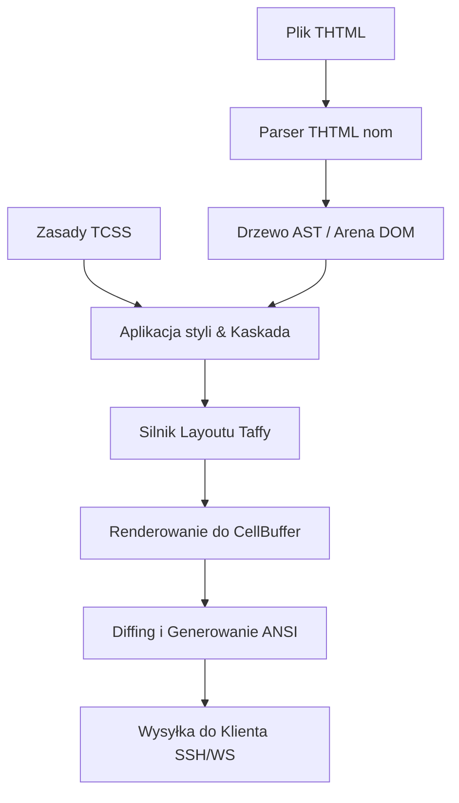

# Architektura OxiTerm

Dokument ten szczegółowo opisuje architekturę systemu OxiTerm — frameworku TUI (Terminal User Interface) działającego w modelu Server-Side Rendering (SSR).

---

## 1. THTML (Terminal HTML)

Język znaczników THTML służy do deklaratywnego opisywania struktury interfejsu terminala.
* **`<screen>`**: Niejawny, najwyższy kontener (root) dokumentu, reprezentujący całą przestrzeń roboczą terminala.
* **`<box>`**: Uniwersalny kontener układu (odpowiednik `
`). Wspiera pełne pozycjonowanie Flexbox.
* **`<text>`**: Reprezentuje zawartość tekstową. Obsługuje automatyczne zawijanie wierszy, znaki Unicode, znaki dwukomórkowe (np. CJK) oraz emoji.
* **`<input>`**: Interaktywne pole tekstowe do wprowadzania znaków z klawiatury.
* **`<button>`**: Focusowalny przycisk wyzwalający zdarzenia akcji.
* **``**: Osadza grafikę wektorową SVG (`.svg`), animacje Lottie (`.json`) oraz interaktywne kontrolki Rive (`.riv`). Grafika wektorowa jest rasteryzowana w czasie rzeczywistym przy użyciu bibliotek `resvg` oraz `tiny-skia` do pikseli, a następnie przesyłana jako protokół graficzny terminala.
* **`<video>`**: Umożliwia płynne odtwarzanie plików wideo (`.mp4` i inne). Klatki wideo są dekodowane i rasteryzowane w tle przy użyciu narzędzia `ffmpeg`.

---

## 2. TCSS (Terminal CSS)

TCSS to uproszczony dialekt CSS dostosowany do siatki znakowej.
* **Jednostki:** Rozmiary (width, height, margin, padding) wyrażane są w postaci liczb całkowitych reprezentujących komórki znakowe (character cells).
* **Układ (Layout):** Wspiera Flexbox (kierunki, wyrównanie osi, odstępy).
* **Kolory:** Obsługa TrueColor (24-bit RGB), 256-kolorowej palety ANSI, słownych nazw kolorów oraz wartości specjalnych (`reset`, `transparent`).
* **Ramki (Borders):** Generowane z użyciem semigrafiki Unicode ( Box Drawing Characters) w stylach: `single`, `double` oraz `rounded`.

---

## 3. Potok Renderowania SSR (Server-Side Rendering)

Proces generowania obrazu i wysyłania go do klienta przebiega w następujących krokach:

1. **Parsowanie THTML:** Parser oparty na bibliotece `nom` buduje drzewo DOM wewnątrz zoptymalizowanej areny pamięciowej (`Arena DOM`), filtrując i sanityzując niebezpieczne znaczniki oraz atrybuty.
2. **Kaskada Stylizacji:** Reguły TCSS z bloku `<style>` oraz atrybutów `style` inline są nakładane na węzły w jednej passie kaskadowej, rozwiązując priorytety (tag < class < id < inline).
3. **Kalkulacja Układu (Layout Engine):** Silnik **Taffy** oblicza ostateczne pozycje i rozmiary każdego elementu na siatce terminala. Na tym etapie warunki `bind-show` są ewaluowane — niewidoczne węzły są oznaczane jako `Display::None` i nie zajmują miejsca.
4. **Renderowanie do Bufora:** Zbudowane drzewo z wyliczonymi wymiarami jest rysowane do dwuwymiarowego bufora klatek (`CellBuffer`). Elementy multimedialne (SVG/Lottie/Rive/Wideo) są rasteryzowane do pikseli i kompresowane do formatów Kitty/Sixel.
5. **Generowanie ANSI (Diffing Engine):** Ostateczna klatka w buforze (`DoubleBuffer`) jest porównywana z poprzednią klatką wysłaną do klienta. Generowana jest minimalna sekwencja kodów ucieczki ANSI sterująca kursorem i kolorami, co dramatycznie zmniejsza narzut sieciowy.

---

## 4. Architektura Transportu

OxiTerm obsługuje dwa niezależne kanały dystrybucji obrazu TUI:
* **SSH Server (russh):** Asynchroniczny demon SSH. Negocjuje parametry PTY (wymiary okna, Kitty Graphics, mysz SGR) i przechwytuje wejściowe strumienie bajtów klienta, odsyłając skompresowane ANSI diffy.
* **WebSocket Server:** Umożliwia uruchamianie aplikacji OxiTerm bezpośrednio w przeglądarkach internetowych z wykorzystaniem terminala xterm.js na froncie.

---

## 5. Odporność i Optymalizacje

Wydajność i odporność OxiTerm w środowisku sieciowym opiera się na kilku kluczowych mechanizmach:
* **Resilient Reactor Thread (RRT):** Dedykowany, nieblokujący wątek OS służący do odczytywania wejścia użytkownika z SSH. RRT parsuje surowy strumień bajtów na zdarzenia klawiatury i myszy (Kitty/SGR) za pomocą `InputStateMachine`, chroniąc pętlę zdarzeń przed zablokowaniem i odpierając ataki DoS (np. zbyt długie sekwencje ucieczki są odrzucane w `sanitize_frame`).
* **Dynamiczna Pętla Animacji (Dynamic Ticking Loop):** W stanie bezczynności pętla renderowania śpi przez `5ms` w oczekiwaniu na zdarzenia. Jeżeli w drzewie DOM znajdują się aktywne animacje Lottie lub Rive, OxiTerm dynamicznie podnosi częstotliwość odświeżania do 15 FPS (`66ms` tick) w celu płynnego odtwarzania klatek animacji.
* **Dwuwarstwowy Cache Graficzny:**
  - `SvgCache`: Przechowuje raz sparsowane drzewa wektorowe `usvg::Tree`, aby uniknąć ponownego kosztownego parsowania XML.
  - `AssetCache`: Przechowuje gotowe, skompresowane strumienie bajtów grafik Sixel/Kitty dopasowane do aktualnej rozdzielczości klatki, omijając cały proces rasteryzacji przy braku zmian.
* **Synchronized Updates (BSU/ESU):** Zapobiega rozrywaniu ekranu (tearingowi) poprzez owijanie paczek ANSI diffów w protokół synchronizacji ramek terminala (`\x1b[?2026h` / `\x1b[?2026l`).
* **Predictive Local Echo:** Lokalny bufor przewidywania tekstu minimalizujący odczucie opóźnienia łącza (latency) u użytkownika piszącego w polach `<input>`.
* **Backpressure (Kontrola przeciążeń):** Ograniczony kanał klatek (`BoundedFrameChannel`). Powolne terminale klienckie, które nie nadążają z odbiorem diffów, powodują bezpieczne pomijanie (dropowanie) klatek na serwerze, co zapobiega wyciekom pamięci.
* **Czyszczenie bufora przewijania:** Przy starcie i zmianie rozmiaru wysyłana jest sekwencja `\x1b[3J`, czyszcząca historię (scrollback) klienta, co zapobiega powstawaniu artefaktów graficznych.

---

## 6. Ułatwienia Dostępu (Accessibility)

Po uruchomieniu serwera z flagą `--a11y`, silnik przełącza się w tryb **LinearFrameSink**:
* Zamiast dwuwymiarowego bufora ANSI, dokument jest renderowany w postaci drzewa liniowego tekstu, idealnego dla czytników ekranu (Screen Readers).
* OxiTerm może integrować się z szyną systemową DBus w systemach Linux w celu bezpośredniej komunikacji z syntezatorami mowy i czytnikami Braille'a.
