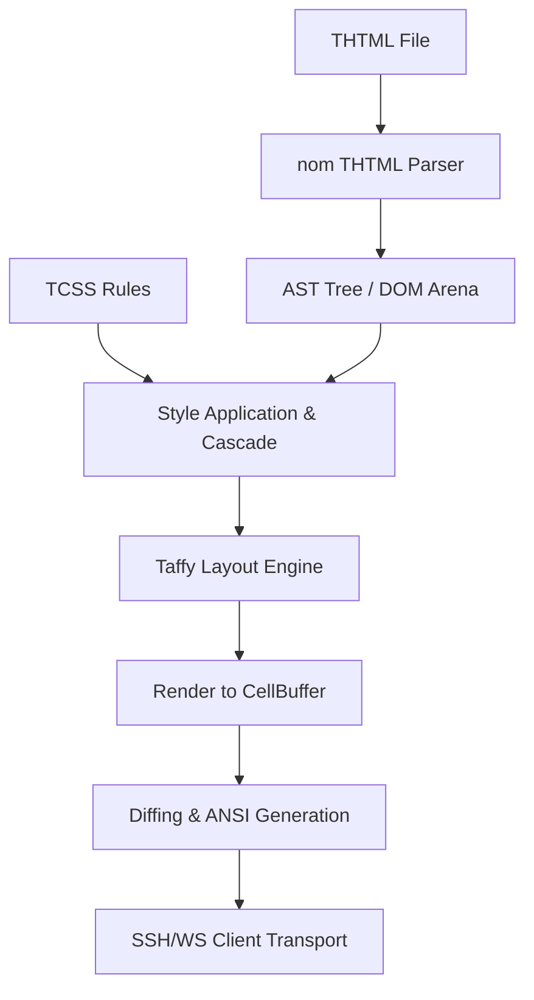

# OxiTerm Architecture

This document details the architecture of the OxiTerm system — a TUI (Terminal User Interface) framework operating in a Server-Side Rendering (SSR) model.

---

## 1. THTML (Terminal HTML)

The THTML markup language is used to declaratively describe the structure of the terminal interface.
* **`<screen>`**: The implicit top-level container (root) of the document, representing the entire terminal workspace.
* **`<box>`**: A universal layout container (equivalent to `
`). Supports full Flexbox positioning.
* **`<text>`**: Represents text content. Supports automatic line wrapping (future/work-in-progress), Unicode characters, double-width characters (e.g. CJK), and emojis.
* **`<input>`**: An interactive text field for keyboard character input.
* **`<button>`**: A focusable button that triggers action events.
* **``**: Embeds SVG vector graphics (`.svg`), Lottie animations (`.json`), and interactive Rive controls (`.riv`). Vector graphics are rasterized in real-time to pixels using `resvg` and `tiny-skia` libraries, and then transmitted using the terminal's graphics protocol.
* **`<video>`**: Enables smooth video playback (`.mp4` and others). Video frames are decoded and rasterized in the background using the `ffmpeg` tool.

---

## 2. TCSS (Terminal CSS)

TCSS is a simplified CSS dialect tailored for character grids.
* **Units:** Dimensions (width, height, margin, padding) are expressed as integers representing character cells.
* **Layout:** Supports Flexbox (directions, alignment, gaps).
* **Colors:** Supports TrueColor (24-bit RGB), 256-color ANSI palette, named colors, and special values (`reset`, `transparent`).
* **Borders:** Generated using Unicode semigraphics (Box Drawing Characters) in the following styles: `single`, `double`, and `rounded`.

---

## 3. SSR Rendering Pipeline (Server-Side Rendering)

The process of generating the frame and sending it to the client proceeds in the following steps:

1. **THTML Parsing:** The parser, based on the `nom` library, builds a DOM tree inside an optimized memory arena (`DOM Arena`), filtering and sanitizing dangerous tags and attributes.
2. **Style Cascade:** TCSS rules from the `<style>` block and inline `style` attributes are applied to nodes in a single cascade pass, resolving priorities (tag < class < id < inline).
3. **Layout Calculation (Layout Engine):** The **Taffy** engine calculates the final positions and sizes of each element on the terminal grid. At this stage, `bind-show` conditions are evaluated — invisible nodes are marked as `Display::None` and consume no space.
4. **Rendering to Buffer:** The built tree with calculated dimensions is drawn to a two-dimensional frame buffer (`CellBuffer`). Multimedia elements (SVG/Lottie/Rive/Video) are rasterized to pixels and compressed to Kitty/Sixel formats.
5. **ANSI Generation (Diffing Engine):** The final frame in the buffer (`DoubleBuffer`) is compared with the previous frame sent to the client. A minimal sequence of ANSI escape codes is generated to control the cursor and colors, dramatically reducing network overhead.

---

## 4. Transport Architecture

OxiTerm supports two independent TUI image distribution channels:
* **SSH Server (russh):** An asynchronous SSH daemon. It negotiates PTY parameters (window dimensions, Kitty Graphics, SGR mouse) and captures input byte streams from the client, returning compressed ANSI diffs.
* **WebSocket Server:** Enables running OxiTerm applications directly in web browsers using the xterm.js terminal on the frontend.

---

## 5. Resilience and Optimizations

OxiTerm's performance and stability in a network environment rely on several key mechanisms:
* **Resilient Reactor Thread (RRT):** A dedicated, non-blocking OS thread used to read user input from SSH. The RRT parses the raw byte stream into keyboard and mouse events (Kitty/SGR) using the `InputStateMachine`, preventing the event loop from blocking and mitigating DoS attacks (e.g., excessively long escape sequences are rejected in `sanitize_frame`).
* **Dynamic Ticking Loop:** In an idle state, the rendering loop sleeps for `5ms` awaiting events. If there are active Lottie or Rive animations in the DOM tree, OxiTerm dynamically raises the refresh rate to 15 FPS (`66ms` tick) for smooth animation playback.
* **Dual-Tier Graphic Cache:**
  - `SvgCache`: Stores once-parsed `usvg::Tree` vector structures to avoid repeating expensive XML parsing.
  - `AssetCache`: Stores pre-compressed Sixel/Kitty graphic byte streams matching the current frame resolution, bypassing the entire rasterization process when there are no changes.
* **Synchronized Updates (BSU/ESU):** Prevents screen tearing by wrapping ANSI diff packets in the terminal frame synchronization protocol (`\x1b[?2026h` / `\x1b[?2026l`).
* **Predictive Local Echo:** A local text prediction buffer that minimizes network latency for users typing in `<input>` fields.
* **Backpressure (Congestion Control):** A bounded frame channel (`BoundedFrameChannel`). Slow client terminals that cannot keep up with receiving diffs cause safe frame dropping on the server, preventing memory leaks.
* **Scrollback Buffer Clearing:** Upon startup and resize, a `\x1b[3J` sequence is sent to clear the client's scrollback history, preventing graphic artifacts.

---

## 6. Accessibility

When launching the server with the `--a11y` flag, the engine switches to the **LinearFrameSink** mode:
* Instead of a two-dimensional ANSI buffer, the document is rendered as a linear text tree, ideal for screen readers.
* OxiTerm can integrate with the DBus system bus on Linux systems to communicate directly with speech synthesizers and Braille displays.

---

## 7. Mobile Responsive Support

OxiTerm features a unified, client-driven responsive design system:
* **Single Client Interface:** The web server serves a unified responsive `index.html` at `/` for all devices. Path-based redirections, multiple HTML documents (`index_mobile.html`), and cookies have been fully removed.
* **Client-Side Classification:** The browser client determines its device classification based on viewport size. Screen widths under `800px` are classified as mobile.
* **Viewport Sync Protocol:** 
  - **Initial Sync:** On WebSocket connection, the client sends a `0x11` binary viewport configuration message containing the initial mobile status flag (`1` for mobile, `0` for desktop).
  - **Dynamic Resize:** If the physical window is resized across the `800px` threshold, the client sends an updated `0x11` message.
* **Server-Side Hot Swap:** When the server receives a `0x11` message, it stores the mobile status in `ClientSession::is_mobile` and issues a `SwitchViewport(is_mobile)` event to the event loop. The event loop reloads the current page layout in real time.
* **Dynamic Template Resolution:** During page loading, the resolver checks if a mobile variant (suffixed with `_mobile.thtml`) exists on disk. If found and `is_mobile` is true, the mobile variant is served; otherwise, it gracefully falls back to the default desktop layout.
* **Mobile-Optimized Layouts:** Mobile templates target a standard PTY grid of `48x30` cells, featuring stacked visual hierarchies and larger interaction tap targets.

---

## 8. Session Lifecycle & Reconnection

OxiTerm manages connections separately from persistent interactive sessions:
* **Session Reattachment:** Browser clients can reattach to existing server-side sessions by presenting a unique session token via the WebSocket connection query string.
* **Connection Takeover:** If a user opens the session in a new tab or window, the server registers the new connection and issues a `0xFF` control byte to the old connection. The old connection immediately terminates its socket and stops auto-reconnection attempts, avoiding contention between the two clients.
* **Session Token Hygiene:** When a session is established or reattached, the client extracts the `session` token from the URL, writes it to `sessionStorage`, and strips it from the address bar history. The visible URL displays only the page query parameter (`?page=`).
* **Auto-Reconnection:** On accidental disconnection, the client enters an auto-reconnection loop with exponential backoff capped at 8 seconds.
* **Reattach Navigation:** If the reattachment URL specifies a different page (e.g., `?page=other.thtml`), the server validates the path and triggers a navigation event (`NavigateTo`) to synchronize the session state to the new page.

